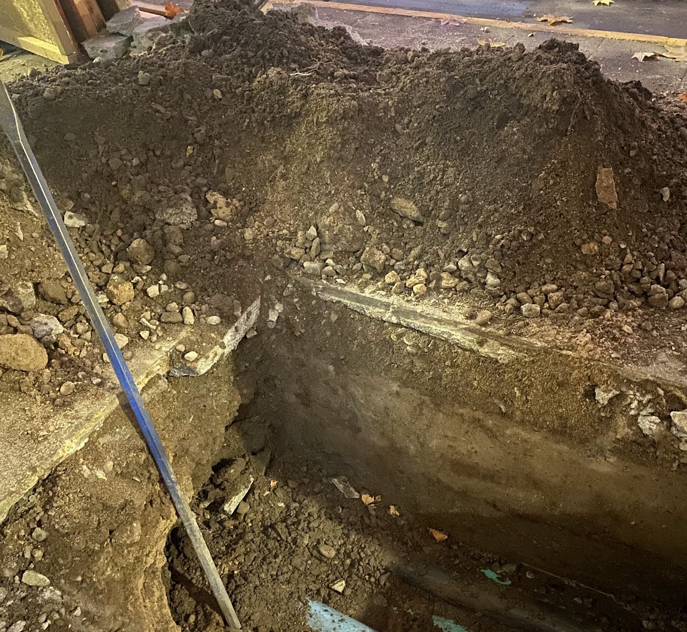
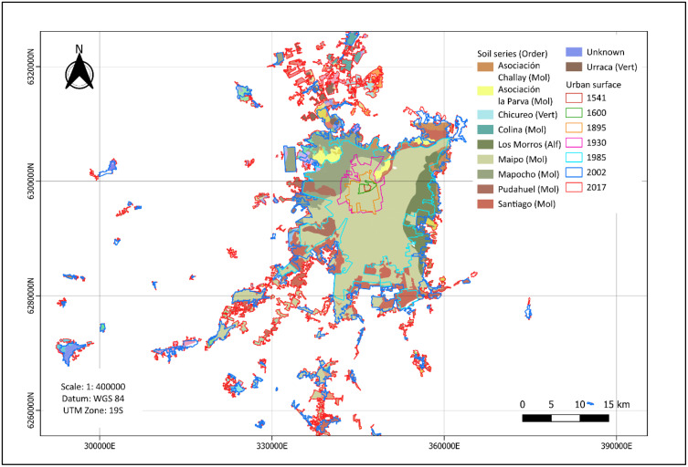
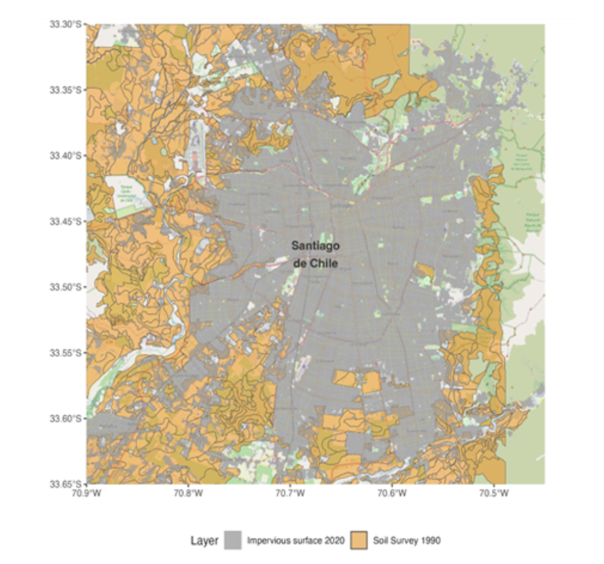
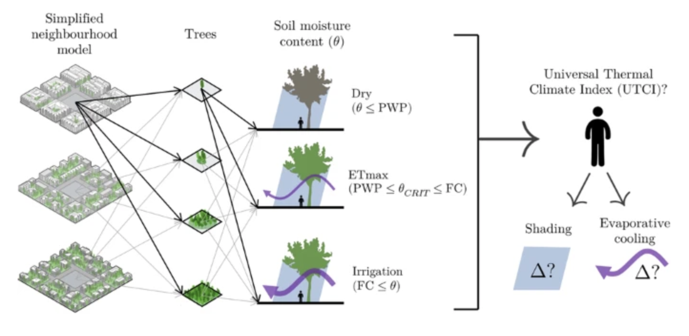
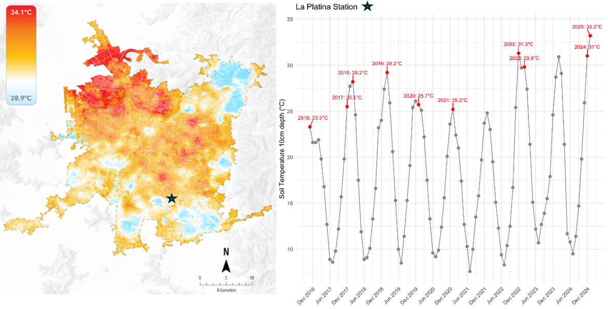
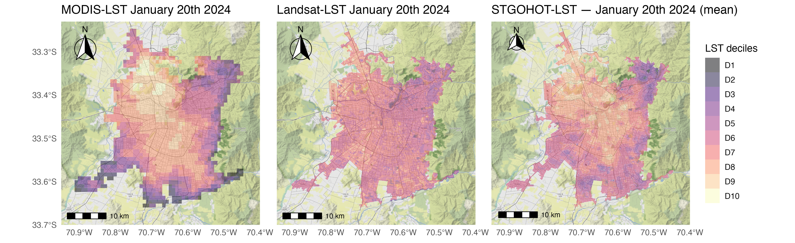
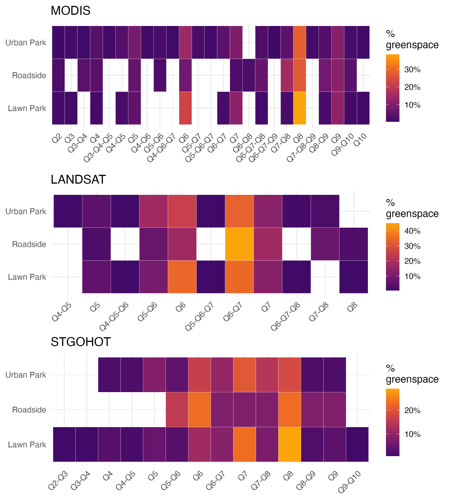
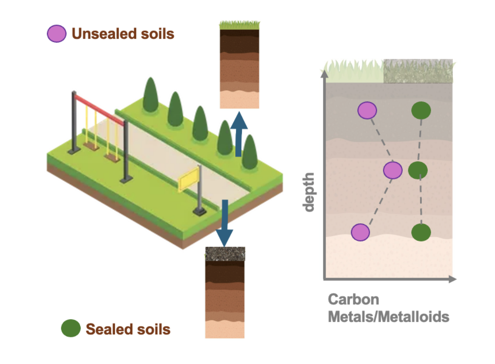
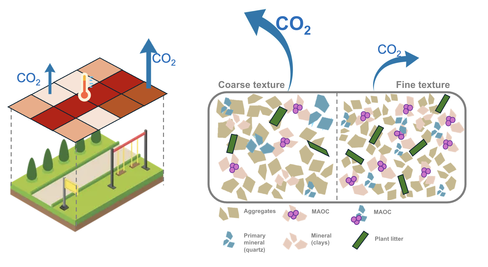

## Acerca de mi 👩🏽‍💻

::: {.fragment fragment-index="1"}
Química mención Analítica y Ambiental [**PUC**](https://quimica.uc.cl/)
:::

::: {.fragment fragment-index="2"}
Master en Suelos y Biogeoquímica [**UC-Davis**](https://www.ucdavis.edu/graduate-programs/soils-and-biogeochemistry)
:::

::: {.fragment fragment-index="3"}
Doctora en Ciencias de la Ingeniería [**PUC**](https://www.ing.uc.cl/hidraulica-y-ambiental/)
:::

::: {.fragment fragment-index="4"}
Profesora Asistente, Facultad de Agronomía y Sistemas Naturales / Ing. en Recursos Naturales
:::

# [¿A qué me dedico?]{.r-fit-text} {background-color="#40666e"}

# Mis líneas de investigación {background-color="#40666e"}

::: incremental
1.  Física de suelos 👩🏽‍🔬
2.  Suelos urbanos 🏙️💧🌱
3.  Análisis de datos y ciencia reproducible 👩🏽‍💻
:::

# [Física y química del suelo urbano 🏙️💧]{.r-fit-text} {background-color="#40666e"}

## Principales desafíos 🏙️💧🌱

1.  Degradación de las funciones físicas
2.  Falta de datos físicos y químicos
3.  Falta de criterios taxonómicos
4.  Las altas temperaturas del suelo urbano 🌡️

## 

::: {#fig-suelos layout-ncol="2" layout-valign="center"}
{#fig-A}

{#fig-B}

Suelos de la Región Metropolitana: Naturales y construidos
:::

## Degradación del suelo urbano

La impermeabilidad del suelo (soil imperviousness) provoca una pérdida casi total de las funciones del suelo y bloquea la infiltración y la evaporación (Leguédois et al., 2016)

La compactación del suelo reduce la porosidad e infiltración. El tráfico peatonal y vehicular aumenta la densidad aparente en más de un 50 % y las actividades de construcción reducen la infiltración en más de un 70 % (Edmonson et al.,2011)

## Falta de datos

::: {#fig-suelosmap layout-ncol="2" layout-valign="center"}
{#fig-A}

{#fig-B}

Últimas publicaciones sobre falta de datos/suelos sellados
:::

::: {#fig-suelos layout-ncol="2" layout-valign="center"}
{#fig-A}

{#fig-B}

Suelos de la Región Metropolitana: Naturales y construidos
:::

## Falta de criterios taxonómicos

### Nadie se pone de acuerdo: suelos naturales urbanos

::: {.smaller style="font-size: 50%; line-height: 1.2;"}
| System                     | Key Concepts                                                          | Typical Urban Classes                                |
|----------------|-----------------------------|---------------------------|
| **WRB**                    | Technosols, Anthrosols, artefacts, Ekranic/Transportic/Urbic features | Ekranic Technosol, Spolic Technosol, Urbic Technosol |
| **USDA Soil Taxonomy**     | Orthents, land phases (Urban land, Cut-and-fill land)                 | Typic Udorthents, Psamments with "urban land" phase  |
| **Russian Classification** | Technogenic soils, Urbostratigic horizons, cultural layers            | Technozem, Urbostratosem, Cultural-layer soils       |
:::

Acevedo et al., 2026 (In review)

## Falta de criterios taxonómicos

### Nadie se pone de acuerdo: suelos construidos

::: {.smaller style="font-size: 50%; line-height: 1.2;"}
| Terminology                                | Definition                                                                                                                                                |
|---------------------------------------------|------------------------------------------------------------------------------------------------------------------------------------------------------------|
| **Constructed soils / Technosols**         | Man-made mixtures of organic and mineral waste, designed to meet specific requirements and widely used in green infrastructure.                            |
| **Engineered soils**                       | Artificially installed soil layers applied for vegetation establishment.                                                                                   |
| **Soil-like substrate**                    | Mixtures of organic and mineral components.                                                                                                               |
| **Tailor-made soils**                      | Mixtures composed of construction/demolition debris, stone-mining waste, natural soil, and compost from pruning of urban vegetation.                       |
| **Plant-growing media (purpose-designed)** | Engineered substrates typically made of sand, crushed brick, gravel, and organic matter.                                                                   |
| **Structural soils**                       | Clay soil combined with coarse aggregate that supports pavement while allowing root growth; coarse units bear loads, while the soil fraction provides nutrients. |

Acevedo et al., 2026 (In review)
:::

## Altas temperaturas

{width=50%}

## Altas temperaturas

## Altas temperaturas

 Trabajo presentado en SUITMA2025 Conference Italy 2025

## Altas temperaturas

Trabajo presentado en SUITMA2025 Conference Italy 2025

## Ahora como seguir?

::: {#fig-suelos layout-ncol="2" layout-valign="center"}
{#fig-A}

{#fig-B}

Focos de investigación
:::

## Donde contactarme 👩🏽‍💻

-   Me demoro en responder correos 🙇🏽‍♀️
-   En instagram: *soilbiophysicsgirls*
-   Web: saryace.github.io

## Referencias 

1. Pantoja, F., Galleguillos, M., & Pfeiffer, M. (2025). Five centuries of urban growth: Impacts on food security and soil functionality. Soil Security, 21, 100212. https://doi.org/10.1016/j.soisec.2025.100212

2. Gobatti, L., Bach, P. M., Maurer, M., & Leitão, J. P. (2025). Impact of soil moisture content on urban tree evaporative cooling and human thermal comfort. Npj Urban Sustainability, 5(1). https://doi.org/10.1038/s42949-025-00220-0

## Referencias 

3. Edmondson, J. L., Davies, Z. G., McCormack, S. A., Gaston, K. J., & Leake, J. R. (2011). Are soils in urban ecosystems compacted? A citywide analysis. Biology Letters, 7(5), 771–774. https://doi.org/10.1098/rsbl.2011.0260

4. Leguédois, S., Séré, G., Auclerc, A., Cortet, J., Huot, H., Ouvrard, S., Watteau, F., Schwartz, C., & Morel, J. L. (2016). Modelling pedogenesis of Technosols. Geoderma, 262, 199–212. https://doi.org/10.1016/j.geoderma.2015.08.008

